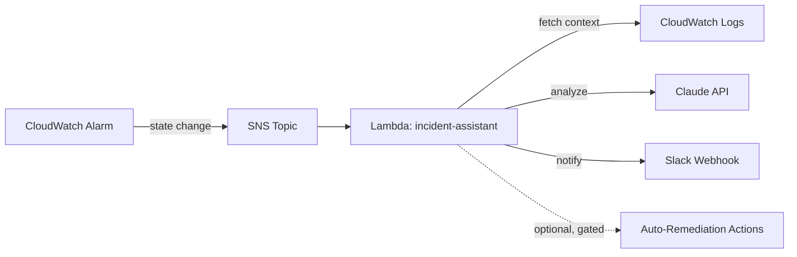

# SentinelOps — AI-Powered DevOps Incident Assistant

Automatically diagnoses production incidents. When a CloudWatch alarm fires,
SentinelOps pulls the relevant logs, sends them to Claude for root-cause
analysis, and posts a structured incident report to Slack — cutting the time
between "alarm fires" and "engineer understands what's wrong."

## Why this exists

On-call engineers waste the first 10–15 minutes of most incidents just
gathering context: which alarm, which logs, what changed recently. SentinelOps
automates that triage step so humans start at "here's likely root cause and
severity" instead of "let me go check CloudWatch."

## Architecture



**Flow:**
1. A CloudWatch Alarm changes state (e.g. error rate threshold breached).
2. It publishes to an SNS topic.
3. SNS triggers a Lambda function.
4. The Lambda pulls the last N minutes of logs for the affected resource.
5. It sends the alarm context + logs to Claude, requesting: root cause,
   severity, remediation steps, and whether auto-remediation is safe.
6. The analysis is posted to Slack as a formatted incident report.
7. (Optional, off by default) Whitelisted auto-remediation actions can be
   wired in for well-understood failure modes — deliberately **not** enabled
   by default, because letting an LLM take unsupervised production actions
   is a real risk, not a demo gimmick.

## Tech stack

| Layer | Tool |
|---|---|
| Compute | AWS Lambda (Python 3.12) |
| Alerting | CloudWatch Alarms + SNS |
| Secrets | AWS SSM Parameter Store (SecureString) |
| IaC | Terraform |
| CI/CD | GitHub Actions (lint, validate, deploy) |
| AI | Claude API (Anthropic) |
| Notification | Slack Incoming Webhook |

## Repo structure

```
sentinelops/
├── lambda/
│   ├── handler.py          # core logic: fetch logs -> call Claude -> post to Slack
│   └── requirements.txt
├── terraform/
│   ├── main.tf              # SNS, Lambda, IAM, example alarm, SSM params
│   ├── variables.tf
│   └── outputs.tf
├── .github/workflows/
│   └── deploy.yml           # lint -> validate -> terraform apply on merge to main
└── README.md
```

## Setup — full step-by-step build guide

This assumes you're starting from nothing: no AWS CLI installed, no
Terraform installed, no repo yet. Every step has the exact command.
**Read the cost warning at the very end before you provision anything.**

### Step 0: Prerequisites — install the tools

**AWS CLI** (Linux/WSL):
```bash
curl "https://awscli.amazonaws.com/awscli-exe-linux-x86_64.zip" -o "awscliv2.zip"
unzip awscliv2.zip
sudo ./aws/install
aws --version
```
On macOS: `brew install awscli`. On Windows: use the MSI installer from AWS's docs.

**Terraform**:
```bash
curl -fsSL https://apt.releases.hashicorp.com/gpg | sudo gpg --dearmor -o /usr/share/keyrings/hashicorp-archive-keyring.gpg
echo "deb [signed-by=/usr/share/keyrings/hashicorp-archive-keyring.gpg] https://apt.releases.hashicorp.com $(lsb_release -cs) main" | sudo tee /etc/apt/sources.list.d/hashicorp.list
sudo apt update && sudo apt install terraform
terraform -version
```
On macOS: `brew install terraform`.

**Python 3.12** (for local testing, if not already installed):
```bash
python3 --version
```

### Step 1: Create an AWS account (if you don't have one)

- Sign up at aws.amazon.com. The Free Tier covers Lambda, SNS, and
  CloudWatch at the volumes this project uses.
- **Do not use your root account for daily work.** Create an IAM user for
  yourself with programmatic access instead:

  1. AWS Console → IAM → Users → Create user
  2. Attach policy `AdministratorAccess` for now (fine for a personal
     learning project; in a real job you'd scope this down)
  3. Create an access key (IAM → your user → Security credentials →
     Create access key → "Command Line Interface")

### Step 2: Configure the AWS CLI with your credentials

```bash
aws configure
```
It will prompt you for:
```
AWS Access Key ID: <paste it>
AWS Secret Access Key: <paste it>
Default region name: ap-south-1
Default output format: json
```

Verify it works:
```bash
aws sts get-caller-identity
```
You should see your account ID and user ARN printed back.

### Step 3: Get an Anthropic API key

1. Go to console.anthropic.com and sign up / log in.
2. Go to "API Keys" → "Create Key".
3. Copy the key (starts with `sk-ant-`) — you won't be able to see it again,
   so save it somewhere safe temporarily.

### Step 4: Set up a Slack Incoming Webhook

1. Go to api.slack.com/apps → "Create New App" → "From scratch".
2. Name it (e.g. "SentinelOps") and pick your workspace.
3. Left sidebar → "Incoming Webhooks" → toggle it on.
4. "Add New Webhook to Workspace" → pick a channel → Allow.
5. Copy the webhook URL (looks like
   `https://hooks.slack.com/services/T000/B000/XXXX`).

### Step 5: Create your GitHub repo and push this project

```bash
cd sentinelops
git init
git add .
git commit -m "Initial commit: SentinelOps AI incident assistant"
```
Create an empty repo on GitHub (github.com/new — don't initialize it with
a README, you already have one), then:
```bash
git remote add origin https://github.com/<your-username>/sentinelops.git
git branch -M main
git push -u origin main
```

### Step 6: Pick a real log group to point this at

You need an existing AWS resource with logs to analyze. If you don't have
one yet, the fastest option is to create a trivial test Lambda first so you
have a log group to point SentinelOps at:
```bash
aws logs create-log-group --log-group-name /aws/lambda/test-target-service
```
Note the log group name — you'll need it in Step 7.

### Step 7: Set your Terraform variables

Create `terraform/terraform.tfvars` (this file is gitignored by convention
— don't commit it if it ever contains anything sensitive):
```hcl
log_group_name = "/aws/lambda/test-target-service"
aws_region     = "ap-south-1"
```

### Step 8: Provision the infrastructure

```bash
cd terraform
terraform init
terraform plan
```
Read the plan output — it should show it creating an SNS topic, an IAM
role, a Lambda function, an SNS subscription, and a CloudWatch alarm.
Nothing should show as "destroy" on a first run.

```bash
terraform apply
```
Type `yes` when prompted. Wait for it to finish — note the outputs it
prints (Lambda function name, SNS topic ARN, alarm name).

### Step 9: Push your real secrets into SSM

The Terraform created placeholder SSM parameters with dummy values — you
now overwrite them with the real ones:
```bash
aws ssm put-parameter \
  --name "/sentinelops/slack_webhook_url" \
  --value "https://hooks.slack.com/services/YOUR/REAL/WEBHOOK" \
  --type SecureString --overwrite

aws ssm put-parameter \
  --name "/sentinelops/anthropic_api_key" \
  --value "sk-ant-YOUR-REAL-KEY" \
  --type SecureString --overwrite
```

### Step 10: Trigger a test alarm manually

You don't need to wait for a real production issue. Force the alarm into
`ALARM` state directly:
```bash
aws cloudwatch set-alarm-state \
  --alarm-name "sentinelops-example-alarm" \
  --state-value ALARM \
  --state-reason "Manual test trigger"
```
Within a few seconds you should see a message land in your Slack channel.
If nothing arrives, check the Lambda's logs:
```bash
aws logs tail /aws/lambda/sentinelops-incident-assistant --follow
```

### Step 11: Set up CI/CD (optional, do this once the manual flow works)

1. In your GitHub repo: Settings → Secrets and variables → Actions
2. Add repository secrets: `SLACK_WEBHOOK_URL`, `ANTHROPIC_API_KEY`
3. Add a repository variable: `LOG_GROUP_NAME`
4. Set up an OIDC IAM role in AWS that GitHub Actions can assume (AWS docs:
   search "GitHub Actions OIDC IAM role"), and add its ARN as the
   `AWS_DEPLOY_ROLE_ARN` secret.
5. Push to `main` — the `deploy.yml` workflow will lint, validate, and
   apply automatically from then on.

### Step 12: Tear it down when you're done demoing it

**Do this — don't skip it.** Leaving this running indefinitely means
ongoing (small but real) AWS charges, and a live Anthropic API key wired to
a public GitHub Actions pipeline is a standing risk if any secret ever
leaks.
```bash
cd terraform
terraform destroy
```
Type `yes` when prompted. Also delete the SSM parameters if `destroy`
doesn't remove them:
```bash
aws ssm delete-parameter --name "/sentinelops/slack_webhook_url"
aws ssm delete-parameter --name "/sentinelops/anthropic_api_key"
```

### A note on cost, since you're a fresher and this matters

Every piece here is Free Tier eligible at low volume. The one thing that
actually costs money per use is the Claude API call — a few cents per
incident at most, but if your alarm is noisy (fires often) before you add
the deduplication fix from the "Known limitations" section, that adds up.
**Don't leave this deployed against a live, flapping alarm unattended** —
run it, take screenshots of the Slack output for your portfolio/resume,
then destroy it per Step 12.

### CI/CD summary
GitHub Actions runs `flake8` on the Lambda code and `terraform validate` on
every PR. On merge to `main`, it applies the Terraform config and pushes
secrets from GitHub Actions secrets into SSM. Use an OIDC deploy role
(`AWS_DEPLOY_ROLE_ARN` secret) — don't use long-lived AWS keys in CI.

## Design decisions worth knowing (for interviews)

- **Why SNS instead of Lambda subscribed directly to the alarm?** SNS
  decouples the alarm from the handler — you can fan out to more than one
  consumer (e.g. add a PagerDuty integration later) without touching the
  alarm config.
- **Why SSM Parameter Store instead of environment variables for secrets?**
  Lambda env vars are visible in the console/API to anyone with read access
  to the function. SSM SecureString keeps secrets encrypted at rest and
  access-controlled via IAM, separate from the function config.
- **Why is auto-remediation off by default?** Letting an LLM take
  unsupervised production actions based on its own log analysis is a real
  operational risk (hallucinated root cause -> wrong "fix" -> bigger outage).
  It's scaffolded but intentionally gated behind an explicit flag and, in a
  real deployment, should be limited to a whitelist of pre-approved, reversible
  actions — not arbitrary commands.

## Known limitations (be upfront about these)

- No deduplication: if the same alarm flaps repeatedly, you'll get repeated
  Slack messages. A real version needs a cooldown/dedup mechanism (e.g. via
  DynamoDB) before it's production-ready.
- Log fetching is a simple `filter_log_events` call — for high-volume log
  groups you'd want to build a more targeted query (CloudWatch Logs Insights)
  instead of pulling raw recent events.
- No automated tests included yet — `flake8` only. Adding unit tests with
  mocked boto3 clients would meaningfully strengthen this.

## Possible extensions
- Add a DynamoDB table to track incident history and avoid duplicate alerts
- Add PagerDuty integration alongside Slack
- Wire in specific, whitelisted auto-remediation actions (e.g. restart an
  ECS service, roll back a Lambda alias)
- Add CloudWatch Logs Insights queries instead of raw log filtering
